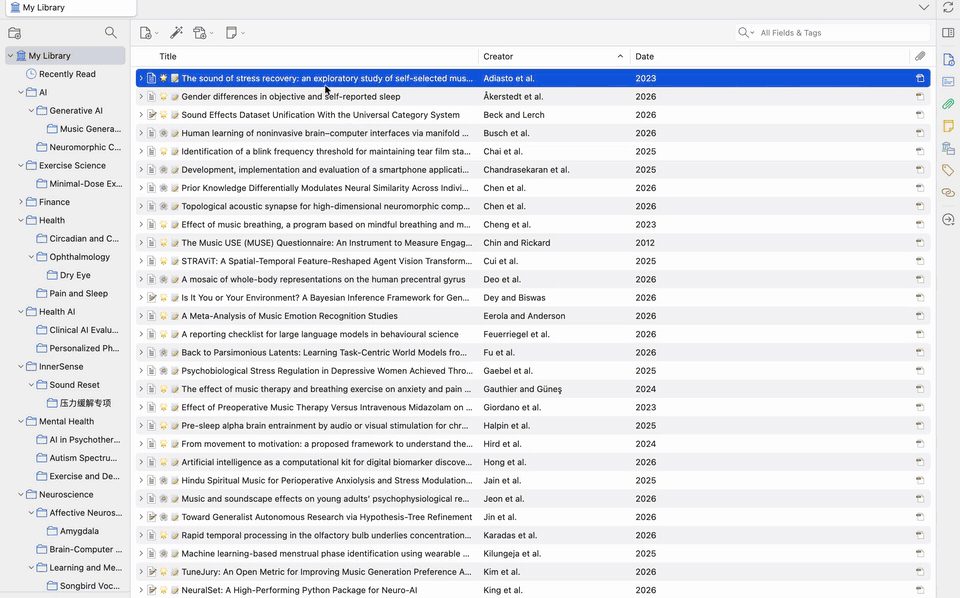

# Mktero

[English](./README.md) · **简体中文**

[](https://github.com/tenglvjun/mktero/actions/workflows/test.yml)
[](https://github.com/tenglvjun/mktero/releases/latest)
[](./LICENSE)
[](https://www.zotero.org/)

[产品介绍页](https://tenglvjun.github.io/mktero/) · [下载最新版本](https://github.com/tenglvjun/mktero/releases/latest) · [参与讨论](https://github.com/tenglvjun/mktero/discussions)

Mktero 是一个适用于 Zotero 7、8 和 9 的来源关联重排阅读器。它通过 MinerU
转换本地 PDF，并在阅读优先的 Zotero 标签页中展示 Markdown 正文、公式、表格、
图片、学术引用和标注；可选的校对模式允许修正识别错误，同时保留不可变的 MinerU
原始结果；可选的 AI 翻译会按一级标题分组并拆成受控批次并发翻译整篇文章，并在原文、译文和连续块级双语对照之间切换。



将复杂论文作为连续文档阅读，从任一视图进行标注，并随时返回原始 PDF 核验证据。

> [!IMPORTANT]
> Mktero 目前处于 Beta 阶段。缓存未命中时，完整 PDF 会上传到 MinerU 进行转换，
> 因此需要 MinerU API Token。处理敏感文档前，请先阅读[缓存与隐私](#缓存与隐私)。
> AI 翻译是独立的数据发送路径，会将正文拆成受控批次后发送给所配置的 Provider，最多同时执行 5 个请求。若占位符完整性连续校验失败，最后一次请求只发送受影响内容块中的普通文本片段。

## 快速开始

### 使用要求

- 桌面版 Zotero `7.0` 至 `9.0.*`
- 可在本机访问的 PDF 附件
- [MinerU API Token](https://mineru.net/apiManage/token)
- 能够访问 MinerU API 的网络环境

文件大小、页数、账户额度和服务可用性由 MinerU 控制，请以
[MinerU API 文档](https://mineru.net/apiManage/docs)中的当前限制为准。

### 安装

1. 从 [GitHub Releases](https://github.com/tenglvjun/mktero/releases/latest)
   下载 `mktero-<version>.xpi`。
2. 在 Zotero 中打开 `工具 -> 插件`。
3. 打开插件管理器右上角的齿轮菜单，选择 `Install Add-on From File...`。
4. 选择 XPI 文件并按 Zotero 提示完成安装。

正式 GitHub Release 可以通过 Zotero 自动更新；草稿和预发布版本不会成为自动更新目标。

### 配置

安装后打开 `设置 -> Mktero`。

| 设置 | 默认值 | 作用 |
| --- | --- | --- |
| API Token | 空 | 本地没有可用转换结果时必填 |
| Semantic Scholar API Key | 空 | 可选；留空时仍可匿名获取引用图谱数据 |
| Body text font | 系统衬线字体 | 可选系统衬线、Georgia、Cambria 或 Times New Roman |
| Body text size | 18 px | 在 16–22 px 间调整 Markdown 和快照字号，同时保持宽且稳定的阅读版心 |
| Reuse conversion results | 开启 | 复用相同 PDF 内容和解析配置对应的结果 |
| 启用 AI 功能 | 关闭 | 通过配置的模型服务翻译 Markdown 文章（一级标题分组、受控批次、最多 5 个并发） |
| 流式响应 | 开启 | 流式接收每个批次响应；关闭后等待每批响应结束 |
| AI Base URL / API Key / 模型厂商 / 协议 / 模型 | OpenAI Responses / 模型为空 | 通过 Vercel AI SDK Core 连接托管 Provider 或回环地址上的本地模型服务 |
| 翻译语言 | 简体中文 | 可选择简体中文、繁体中文、日文、韩文、西班牙语、法语或葡萄牙语（巴西）；默认论文原文为英文，因此不提供英文翻译 |
| 请求超时 | 600,000 毫秒 | 单个 Markdown 批次请求最长可等待一小时 |
| 最大输出 Token 数 | 自动（0） | 默认由 Provider 决定；所选模型支持时最高可设为 262,144 |

MinerU API Token、Semantic Scholar API Key 和 AI API Key 都会作为普通首选项未加密地保存在当前 Zotero
配置文件中。开始翻译前，可使用“测试连接”验证当前 AI 地址、Key、模型厂商、协议和模型。
该探测只要求 Provider 成功返回响应；只有 reasoning、没有可见正文的响应也会判定为成功。

### 打开和阅读 PDF

1. 打开 PDF 后点击阅读器工具栏中的 Mktero 文件图标；也可以右键单个 PDF 或文库
   条目，选择 `Read as Markdown with Mktero`。
2. Mktero 会打开临时标签页，并显示上传、转换和下载进度。存在有效缓存时会跳过
   远程转换。
3. 使用目录、引用和图表预览、来源链接以及 Zotero 笔记面板浏览文档。
   点击引用跳转到参考文献后，可以使用工具栏中的左箭头按钮，或按
   `Alt+Left`（macOS 使用 `Command+[`）返回原引用位置。
4. 使用 Markdown 正文上方的固定工具栏调整字号和字体、切换阅读模式或翻译全文；这些控件
   省略了可由交互本身表达的可见标题，同时保留无障碍名称，并使用紧凑且一致的间距；
   常规阅读宽度下，翻译进度会压缩在主工具栏单行内，翻译按钮与阅读模式之间带有分割线。
   译文可用后，阅读模式 Tab 会直接显示目标语言，不再通过右侧独立标签重复显示。
   点击该 Tab 会打开语言菜单：完整译文会立即切换，选择不完整或尚未翻译的语言则会继续或开始翻译。
   简体中文、繁体中文、日文和韩文译文会自动使用对应语言的学术衬线字体回退；选择“阅读译文”
   时，字体下拉框会切换为当前译文语言的论文阅读字体，“阅读原文”和“双语对照”仍显示原文字体。
   相关操作可用时，右侧更多
   菜单包含 `管理校对`、`重新翻译全文`、`重新解析 PDF` 和 `保存快照`。

重新解析会再次上传 PDF，并可能消耗 MinerU 额度。新结果准备完成前，当前 Markdown
仍可继续阅读。Mktero 标签页仅在当前会话存在，重启 Zotero 后不会自动恢复。

### 浏览文库引用图谱

右键单个 Zotero 文献条目或 PDF 附件并选择 `打开引用图谱`，也可以点击 PDF 阅读器
工具栏中的网络图标。Mktero 为每个文库只打开一个当前会话有效的图谱标签页，并自动聚焦
所选论文。当前文库中的每个普通文献条目都会保留为节点；没有可靠 DOI 或 arXiv 标识符的
论文会保留为孤立节点。有向边表示来源论文引用目标论文，并且只有两篇论文都已存在于当前
Zotero 文库时才会显示该边。

引用数据仅来自 Semantic Scholar。Mktero 只发送 DOI 和 arXiv 标识符，不发送 PDF、
Markdown、笔记、标注、本地路径、Zotero key 或完整条目记录。界面会先显示本地缓存，
再逐条刷新缺失或过期的数据。搜索、全部/有关联筛选，以及可通过键盘操作的参考文献/引用本文
列表都可以聚焦论文；双击节点或点击 `在 Zotero 中打开` 会优先打开 PDF，没有 PDF 时选择
对应的 Zotero 条目。清空 Mktero 本地缓存也会删除引用记录缓存。

### 校对识别错误

在普通阅读界面中直接双击段落、标题或 GFM 表格单元格即可编辑。聚焦可编辑内容块后，
也可以按 `Enter` 或 `F2` 进入编辑。文本和表格使用统一的显式操作栏：只有内容发生变化后
才会启用“保存”，可以通过“保存”“取消”以及 `Ctrl/Command+Enter` 或 `Escape` 完成一致的
提交和取消操作。离开表格单元格不会自动保存；保存失败时会保留当前输入，便于重试或取消。
内容块操作栏还可以直接删除整个段落或标题，无需逐字删除；成功删除后会短暂显示“撤销删除”
提示。链接、图片、引用和批注等交互元素保留原有的双击行为。

在更多菜单中选择 `管理校对`，可以集中查看已修改的内容，并恢复单个已删除的内容块。
已删除的内容块只会在管理模式中显示紧凑的可恢复占位；普通阅读界面会隐藏校对标记，
并折叠删除内容留下的间距。更多菜单中仍可以一次恢复全部校对。

校对结果绑定当前 PDF 内容和 MinerU 解析配置，并与转换缓存分开保存，因此缓存清理或
过期不会删除校对。`重新解析 PDF` 会先确认是否永久删除已有校对；第一版不会将校对
自动合并到新的解析结果中。编辑范围有意限制在已有段落、标题和 GFM 表格单元格，不能
插入或移动内容块；可以删除已有段落或标题，但不能新增图片或原始 HTML。

如果安装了 Actions & Tags for Zotero，Mktero 会为自己拥有的阅读会话兼容执行
`openFile` 和 `closeTab` 规则，同时避免重复触发原生阅读器动作。

### 使用 AI 翻译整篇 Markdown 文章

先在 `设置 -> Mktero` 中配置并启用 AI 翻译，再点击 Markdown 标签页工具栏中的
`翻译全文`。Mktero 会先按 Markdown 一级标题分组经过保护的文档，再将每组拆成最多 8 个
内容块、约 2000 个估算源文本 Token 的批次，最多同时发送 5 个请求。响应按内容块 ID 匹配并
按原始顺序合并；缺失或无效的内容块最多单独重试 2 次。若最后一次重试改动了受保护占位符，
Mktero 会再发起一次兜底请求，仅包含该内容块中带稳定 ID 的普通文本片段；公式、引用、图表
编号和内部占位符不会进入这次请求。译文片段会在本地与原受保护内容重新组装，并再次通过相同的
结构、顺序和输出大小校验。参考文献区域保持原样。请求前，
代码、图片、独立公式、链接定义、原始 HTML、URL、行内代码，以及可交互的论文引用、角标、
图引用、表引用和对应目标标签会被替换为受保护占位符；只有响应通过结构校验后才会恢复。
恢复后的数字引用和行内公式即使紧邻中日韩译文，也会继续按引用和数学内容渲染。
图表说明和引用周围的正文仍会正常翻译。翻译只会在用户明确点击后开始，不会改写原始
Markdown，也不会进入保存的快照。
默认使用流式传输，但阅读器
只在全部请求批次处理完成后更新，不会按每个 token 重绘全文。翻译进行时，工具栏会显示旋转的加载
图标、目标语言、已完成内容块数量和百分比，并保留“取消翻译”操作；再次点击即可停止当前
请求。已有完整译文后，取消入口会移入译文语言菜单，当前论文仍可继续阅读。后台重试期间，
已有的原文、译文和双语视图仍可继续阅读和切换。

自动重试后仍然失败的内容块会保留原文，并将结果标记为可重试的“部分完成”；已经成功的译文
仍可阅读。每个未翻译内容块会在正文中明确标记，可从工具栏重试全部未完成翻译，也可在失败
位置之间跳转；导航控件会显示当前位置和总数，例如 `1/3`。

翻译完成后，可以在工具栏选择 `阅读原文`、`阅读译文` 或 `双语对照`。每次打开文档默认
显示原文；双语对照使用一个连续阅读文档，每个原文标题、段落、列表、引用或表格后紧跟
对应译文。译文使用克制的左侧细线、缩进和较弱的标题层级加以区分，目录只保留原文标题；
工具栏始终显示译文语言，翻译进行时增加进度，部分完成时只显示未翻译数量；全部完成后不再
重复显示 `N/N`。即使 Zotero 侧栏占用正文宽度，单一阅读面仍能正常阅读。
在双语对照中，原文内容块继续支持 PDF 标注、来源跳转、带来源复制和新建 Markdown 标注；
译文内容块不会显示这些仅适用于原文的操作。双语内容块在阅读时保持稳定，不随悬停或聚焦
高亮，也不提供针对单个内容块的翻译操作；更多菜单中的 `重新翻译全文` 会使用当前 Provider
和模型设置重新生成当前可见语言的整篇译文。

Mktero 的所有 AI 调用都通过 Vercel AI SDK Core。内置 OpenAI、Anthropic、Google
Gemini、DeepSeek、阿里云百炼、Moonshot/Kimi 和 MiniMax 适配器，并支持自定义兼容
服务。协议决定调用 OpenAI Responses、OpenAI Chat Completions、Open Responses、
Anthropic Messages 或 Google Generative Language；设置页只允许选择与当前模型厂商兼容
的协议。可用模型及其 ID 仍由厂商决定。远程地址必须使用 HTTPS；Ollama、LM Studio 等
运行在回环地址上的本地服务可以使用 HTTP，在服务未启用认证时也可以不填 API Key。

译文内容块保存在对应 PDF 的 Markdown 缓存条目中，并按原文、Provider、协议、模型、
目标语言和 Prompt 版本区分，每种目标语言保留独立结果。设置中的翻译语言只作为论文首次
翻译时的默认值；更改设置不会替换、取消或启动已打开 Markdown 标签页中的翻译。只要已有
完整译文可读，主工具栏就不再显示翻译按钮。译文阅读模式 Tab 的菜单会列出当前论文和模型
配置支持的全部语言：选择完整语言会直接切换缓存，不会再次请求 AI；选择部分完成或尚未
翻译的语言会继续或开始该语言的翻译，并且不会修改设置中的默认语言。部分缓存会继续补译
缺失内容块，不会被误当成完整译文。阅读时会按原始顺序从缓存内容块重建
完整译文和双语对照文档，因此展示方式更新无需再次请求 AI。
清除、替换或淘汰该 Markdown 缓存条目时会同时删除其全部译文。列表、引用和 GFM 表格会翻译；
图片、代码、独立公式、链接定义、原始 HTML 和可交互的学术引用标签保持原样。关闭标签页、
重新解析、校对 Markdown 或关闭 Mktero 时，进行中的
翻译请求都会取消。

### 保存便携 Zotero 快照

选择 `保存快照` 后，Mktero 会在 PDF 所属文献条目下创建专用的
`Mktero Markdown Snapshot` Note。便携 HTML 保存在 Note 中，图片保存为嵌入附件，
原始 Markdown 和来源映射保存为关联附件，之后由 Zotero 正常同步。

安装 Mktero 的桌面端会优先使用同步的 Markdown 源文件，其他客户端可以直接阅读便携
HTML Note。用户修改过快照 Note 后，Mktero 会拒绝静默覆盖。没有所属文献条目的独立
PDF 不能保存快照。

## 核心能力

- 将 OCR 结果、双栏正文、公式、表格、图片、列表和代码重排成连续阅读文档。
- 在保留 MinerU 原始 Markdown 和校对历史的前提下，修正已有段落、标题和 GFM 表格
  单元格中的识别错误，并可删除多余的段落或标题。
- 通过配置的 Vercel AI SDK Provider 使用受控批次并发翻译整篇 Markdown，并支持原文、译文和连续块级双语对照阅读。
- 使用适合论文阅读的 STIX/Noto 衬线字体回退，并为支持的围栏代码块异步提供 Shiki
  语法高亮、语言标签和代码复制。
- 当 MinerU 把标题提取到表格前后，或把表格标题误分配给下一张图片时，自动恢复相邻
  表格与图片标题的正确归属；合成图的子图文字与正式图注被分开提取时也能正确识别。
- 保留可靠的 PDF 页码和区域映射，使正文、公式、表格和图片可以返回原始 PDF。
- 在不离开当前阅读位置的情况下预览引用、作者单位、图片和表格。
- 在 Markdown 中显示 Zotero PDF 高亮和下划线，并支持新建、改色、评论和删除标注。
- 来源可靠时，复制内容可附带论文标题、PDF 物理页码和 Zotero 回链。
- 使用内容寻址的本地缓存，并可恢复最近上传的 MinerU 任务，避免重复上传同一 PDF。
- 只展示当前 Zotero 文库内部的有向引用关系，并以缓存优先方式刷新 Semantic Scholar 数据。
- 英文和简体中文界面自动跟随 Zotero 显示语言，其他语言回退为英文。

## 工作原理

```text
Zotero 本地 PDF
        |
        v
MinerU 转换 ----------> Markdown + 图片 + 内容映射
        |                              |
        v                              v
本地内容缓存                    安全规范化与渲染
                                       |
                                       v
                            Zotero 中阅读优先的 Mktero 标签页
```

Mktero 将 PDF、转换结果、压缩包、图片路径、API 响应和首选项都视为不可信输入。
Markdown 会经过规范化，并在隔离的 shadow root 中渲染，不会作为任意 HTML 插入 Zotero
chrome 文档。

## 标注与来源链接

每次打开文档时，Mktero 都会重新读取已有的 Zotero 文本高亮和下划线。在普通
Markdown 正文中划词，可以立即创建本地高亮或笔记；Mktero 随后使用本地 PDF.js
文字索引，仅在能够可靠定位原文时创建对应的 Zotero 标注。失败或存在歧义的匹配会保留
在本地并允许重试，Mktero 不会猜测 PDF 位置。当选中文本出现多次时，Mktero 会比较选区
前后最多各 80 个可见字符来区分候选位置，而最终 PDF 高亮仍然只覆盖原选区；如果前后文
也无法确定唯一候选，匹配会继续保持歧义。上下文消歧依赖本地 PDF.js 文字索引；如果该索引
不可用，Zotero 阅读器兜底会让重复选区继续保持歧义，而不会扩大 PDF 高亮范围。匹配过程
可兼容引用上标、统计指数、包括紧跟左括号写法在内的 LaTeX 关系运算符、错误解码的温度
度数符号、Markdown 转义百分号和 PDF 跨行断词。同一选区中的词内连字符与行尾断词
连字符可分别判断；同一视觉行内错位的连字或数字前缀符号也会被规范化。
错误编码的正负号只会在长篇且唯一匹配的文本中进行兼容处理。

将已有 Zotero PDF 标注加载到 Markdown 时，Mktero 会根据标注的页码和排序索引定位
它在 PDF 中的准确出现位置，再取其前后最多各 80 个字符，与经过可靠页码过滤后剩余的
Markdown 候选位置上下文进行比较。Markdown 中的覆盖范围仍只包含原始标注文本；如果
PDF 索引、来源偏移或上下文无法确定唯一候选，标注会继续保持歧义，而不会被放到猜测的位置。

可靠的 MinerU 内容映射也用于来源跳转和附带来源复制。页码提示会将标注匹配限制在正确的
PDF 物理页；区域坐标只用于来源跳转，不会被当作猜测的标注矩形。

## 缓存与隐私

| 数据 | 保存或发送位置 | Zotero 同步 |
| --- | --- | --- |
| 缓存未命中时的完整 PDF | 上传到 MinerU | Mktero 不同步 |
| API Token | 当前 Zotero 配置文件，未加密 | 否 |
| AI API Key | 当前 Zotero 配置文件，未加密 | 否 |
| Semantic Scholar API Key | 当前 Zotero 配置文件，未加密 | 否 |
| 引用图谱使用的 DOI 和 arXiv 标识符 | Semantic Scholar | Mktero 不同步 |
| 用户选择全文翻译后拆分的受保护 Markdown 批次，以及仅在占位符完整性连续失败后使用的普通文本片段 | 配置的 AI Provider | Mktero 不同步 |
| 缓存的 Markdown、图片、来源映射和 PDF 文字索引 | 当前 Zotero 配置文件，未加密 | 否 |
| 缓存的 AI 译文 | 当前 Zotero 配置文件，未加密 | 否 |
| 缓存的 Semantic Scholar 引用元数据 | 当前 Zotero 配置文件，未加密 | 否 |
| 待完成 MinerU 任务的 ID 和时间戳 | 当前 Zotero 配置文件，未加密 | 否 |
| 待同步的 Markdown 标注记录（包括用于匹配的有界前后文） | 当前 Zotero 配置文件，同步前未加密保存 | 否 |
| 校对后的 Markdown 内容块及其基础图片和来源映射 | 当前 Zotero 配置文件，未加密 | 否 |
| 已同步的 PDF 标注 | 本地 Zotero 文库 | 取决于 Zotero 设置 |
| 保存的快照 Note、HTML、Markdown、来源映射和图片 | Zotero 条目和附件，未加密 | 取决于 Zotero 设置 |

本地缓存不包含 API Token、Semantic Scholar API Key、AI API Key 或 PDF 标注评论。PDF 标注和本地 PDF.js 索引
不会发送给 MinerU 或 AI Provider。全文翻译会向配置的 AI Provider 并发发送最多 5 个
经过保护的 Markdown 批次和翻译指令。若某个内容块的占位符完整性连续校验失败，最后一次请求
只发送该块的普通文本片段，受保护公式、引用、图表编号和占位符仍保留在本地。“复制并附带来源”只读取本地条目元数据，并将生成的结果
写入系统剪贴板。引用图谱请求只向 Semantic Scholar 发送规范化后的 DOI 和 arXiv 标识符；
引用元数据缓存保存在本地、未加密且不会由 Zotero 同步，外部 Semantic Scholar 论文不会成为图谱节点。

校对数据保存在当前 Zotero 配置文件中，并独立于普通转换缓存；清理缓存不会清理校对。
校对默认只保存在当前设备，除非用户将其保存到 Zotero 快照。包含校对的快照会明确显示
来源说明和校对数量。

待完成任务记录只包含 MinerU 任务标识、Mktero data ID 和上传时间，不包含 PDF、
文件名、本地路径、上传或下载地址、API Token 或带认证的 API 响应。

保存的快照不包含原始 PDF、MinerU 结果压缩包、API Token 或 API 响应；其同步方式和
存储配额由 Zotero 控制。

## 安全边界与当前限制

- Markdown 默认只读。校对模式可以替换已有段落、标题和 GFM 表格单元格的内容，也可
  删除已有段落或标题；除此之外不能改变文档结构、公式、图片或原始 HTML。标注操作与
  Markdown 校对相互独立。
- AI 翻译是可选的本地缓存阅读层，不会自动开始，不修改原始 Markdown，不通过 Zotero
  同步，也不会把译文写入快照。所有调用通过 Vercel AI SDK Core，并按所选模型厂商和协议
  路由；Mktero 会优先请求关闭推理以提高翻译速度。如果所选模型或 Provider 明确拒绝
  关闭推理，Mktero 会使用该 Provider 的默认行为重试一次，且暂不开放推理强度设置。
- 仅支持本地 PDF 附件；缺失或尚未下载的文件无法转换。
- 文本标注依赖可提取的 PDF 文字层。扫描版 PDF 可能可以通过 OCR 转换，但仍无法生成
  精确的 Zotero 高亮矩形。
- 当前只显示文本高亮和下划线，不显示独立便签、图片或区域标注以及手写标注。
- 来源跳转依赖稳定版 MinerU `*_content_list.json`。旧缓存仍可阅读，但可能没有来源
  链接。
- 当前只支持从 Markdown 跳转到 PDF；尚不支持反向跳转和原译文同步滚动。
- Markdown 图片只能解析当前结果压缩包中的 GIF、JPEG、PNG 和 WebP，不加载远程图片。
- 链接协议限定为 `http`、`https`、`zotero` 和当前文档片段。
- 原始 HTML 默认转义；清理后的 MinerU 表格只允许有限的标签和属性。
- 压缩包、Markdown、图片、来源映射、PDF 索引和 KaTeX 渲染均有本地资源上限，超限时
  会安全停止处理。

## 转换排障

在 Zotero 中打开 `帮助 -> 调试输出日志`，启用日志后重新执行转换，并筛选 `Mktero:`。
常见阶段包括：

- `requesting a MinerU upload URL`
- `uploading PDF to MinerU`
- `PDF upload completed; MinerU is parsing`
- `MinerU parsing finished; downloading the result`
- `completed from local cache; MinerU upload skipped`
- `completed from a resumed MinerU task`

日志不会记录 API Token、预签名上传地址、MinerU batch ID 或 PDF 内容。若仍然失败，
请确认附件已下载到本机、Token 有效，并且当前网络可以访问 MinerU。

## 开发

使用 [`.node-version`](./.node-version) 指定的 Node.js `24.15.0`。Node.js 25 不在依赖
支持范围内。

```bash
npm ci
npm run check
npm test
npm run build
```

构建会生成未压缩扩展、可复现的 `build/mktero-<version>.xpi`、SHA-256 校验文件以及
`build/updates.json`。生成的 `build/` 和 `node_modules/` 目录已被忽略，不应提交。

创建 `v<version>` 标签前，必须保持 `manifest.json`、`package.json` 和
`package-lock.json` 中的版本一致。Release 工作流会在发布前校验标签与
`manifest.json` 的版本。普通推送和 Pull Request 只执行测试、构建与 CodeQL，
不会发布新版本。

仓库架构、编码规则、安全约束和跨文件修改清单见 [AGENTS.md](./AGENTS.md)。

## 反馈与贡献

- 阅读工作流、功能想法和 Beta 反馈请前往
  [GitHub Discussions](https://github.com/tenglvjun/mktero/discussions)。
- 已确认且可以复现的问题请提交到
  [GitHub Issues](https://github.com/tenglvjun/mktero/issues)。

反馈时请提供 Zotero 与 Mktero 版本、操作系统、PDF 类型、复现步骤、预期行为和实际
行为。请勿提交 API Token、私密 PDF、带认证信息的链接、本地文件路径或其他敏感信息。

欢迎提交 Pull Request。修改运行时行为时，请执行上面的完整验证命令并遵循
[AGENTS.md](./AGENTS.md)。

## License

[MIT](./LICENSE) © 2026 Tony
